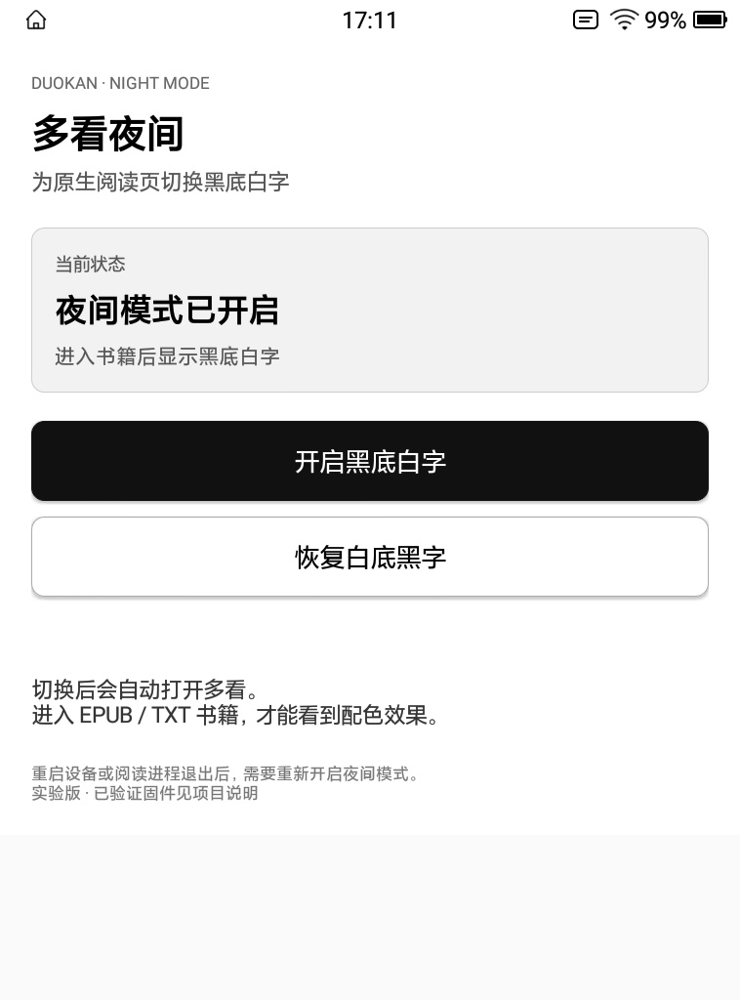
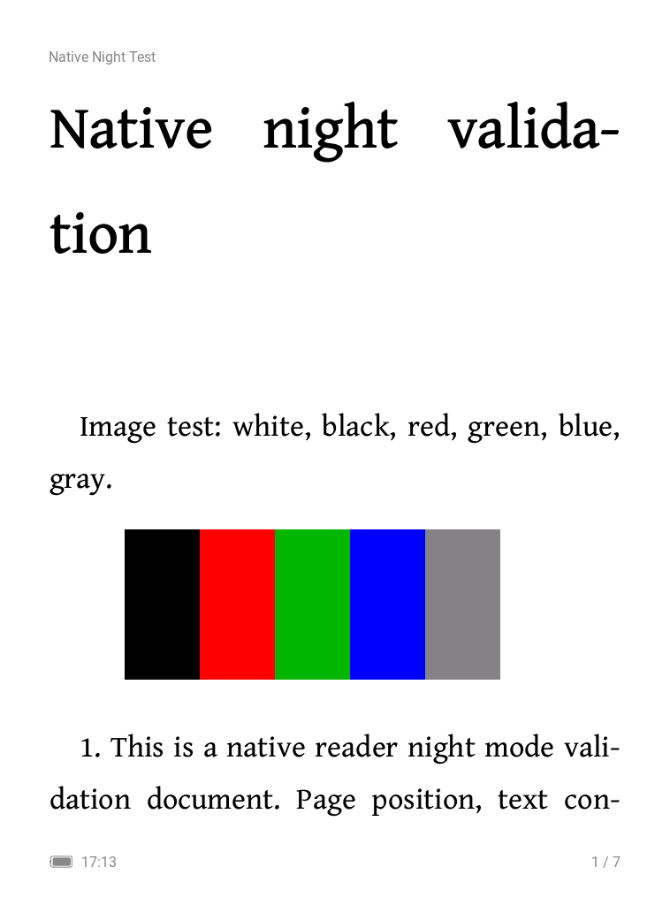
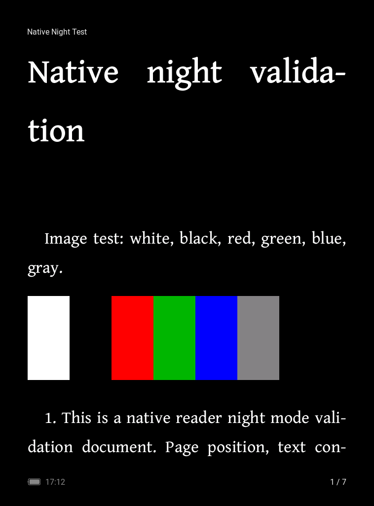

# 多看夜间 · Duokan Night

为受支持的 EPD106 原生多看阅读器提供 **黑底白字**。独立辅助应用通过同签名 Instrumentation，在阅读进程内替换 E-Ink 配色接口。

辅助应用提供清晰的当前状态、三秒倒计时和自动打开多看。进入 EPUB / TXT 书籍后生效。

> 实验项目。当前兼容范围以本页表格为准；原厂阅读器 APK、书库与系统分区保持原样。进程退出或重启后，需要重新开启。

## 效果预览



| 默认日间 | 夜间模式 |
| --- | --- |
|  |  |

以上图片是实际设备中原生 View 的渲染截图；彩色色条用于确认图片未被反色。墨水屏实拍照片由项目维护者后续补充。

## 已验证设备

| 项目 | 验证值 |
| --- | --- |
| 设备 | EPD106 / virgo_perf1 |
| Android | 8.1 / API 27 |
| 固件 | 20231122-151132 |
| 原生阅读器 | com.duokan.einkreader，1.2.7，versionCode 573231113 |
| 阅读进程 | com.duokan.einkreader:eink |
| 签名证书 SHA-256 | c8a2e9bccf597c2fb6dc66bee293fc13f2fc47ec77bc6b2b0d52c11f51192ab8 |

此证书与 AOSP 公开的 platform 测试证书相同。Instrumentation 需要与目标应用签名匹配；其他设备或版本的兼容性待验证。详见 [兼容性与实现](docs/TECHNICAL.md)。

## 使用

实验版安装包见 [Releases](https://github.com/Muyu-Chen/duokan-night-mode/releases)。仅适用于已验证的签名与固件。

1. 安装本项目的签名辅助 APK，打开 **多看夜间**。
2. 页面会重新检查当前阅读进程，显示 **夜间模式已开启 / 已关闭**。
3. 点击 **开启黑底白字** 或 **恢复白底黑字**，等待 **3 → 2 → 1**。
4. 自动打开多看后，进入 EPUB / TXT 书籍查看效果。书架和顶部系统状态栏不属于本项目的阅读页配色范围。

切换会重新启动阅读进程；先离开正在阅读的书籍，让原生阅读器保存进度。没有夜间会话时显示关闭，不使用上次按钮选择冒充当前状态。

## 构建与安装

需要 Windows、JDK 17 或更新版本、Python 3.11 或更新版本。脚本使用官方 API27 SDK 与 Build Tools 28.0.3。

```powershell
python scripts/bootstrap-sdk.py
python scripts/build.py --unsigned
```

这会生成 build/duokan-night-unsigned.apk；它只用于编译检查。实机运行需要与上表匹配的签名材料，签名文件由使用者在本地自行准备，仓库不包含它们。

```powershell
python scripts/build.py --signing-key <本地pk8文件> --signing-cert <本地x509.pem文件>
./scripts/install.ps1 -Adb <adb路径>
```

构建器检查签名证书和 UTF-8 应用名称。更多信息见 [构建说明](docs/BUILD.md)。

## 验证与边界

- 已验证的主题逻辑：EPUB / TXT 黑底白字、EPUB 图片颜色保持、默认日间配色恢复。
- 新界面的倒计时、自动打开多看、实时状态查询测试记录见 [验证记录](docs/VALIDATION.md)。
- 阅读进度、批注、高亮、持续翻页残影、后台驻留与低内存行为仍需完整回归。
- 没有可比较的重复 PSS 测量，不承诺节省内存或提升续航。
- PDF 与其他固件目前不在已验证范围内。

## 开源范围

本仓库只包含原创辅助源码、构建/安装脚本、文档与展示截图。不包含原厂 APK、反编译源码/字节码、固件镜像、用户书籍、设备私有日志、序列号、账号令牌或签名文件。

采用 [MIT License](LICENSE)。多看、EPD106 和 Android 等名称用于说明兼容对象；本项目由社区独立维护。
